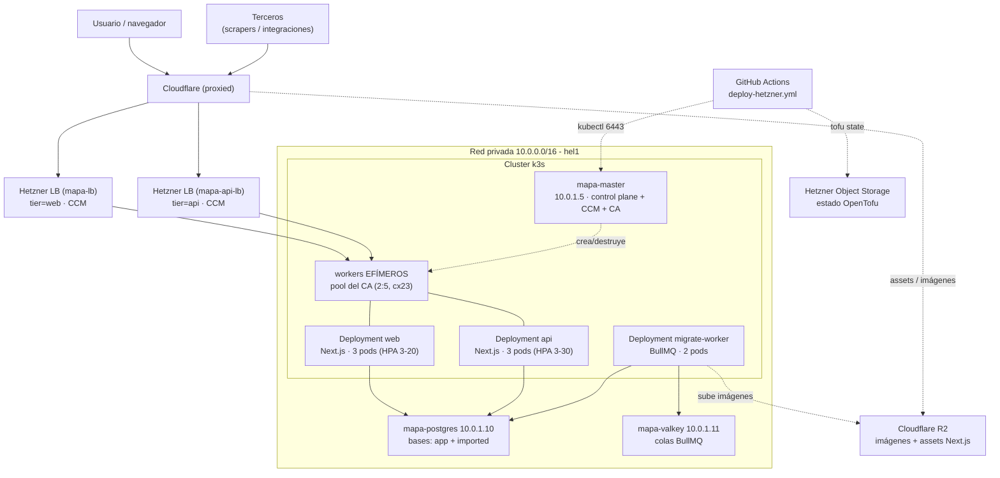

# Arquitectura del despliegue (Hetzner + k3s + OpenTofu)

Cómo está desplegada **hoy** la app: infraestructura en Hetzner Cloud
provisionada con **OpenTofu**, un clúster **k3s** que corre la app y los
workers, y **Cloudflare** (R2 + CDN + TLS) por delante.

> Fuente de verdad de la infra: [`infra/tofu/`](../../infra/tofu/) (servidores,
> red, firewall) y [`infra/k8s/`](../../infra/k8s/) (manifiestos del clúster).
> El pipeline que lo aplica: `.github/workflows/deploy-hetzner.yml`.

## Resumen

- **Provisión:** OpenTofu (provider `hcloud`), estado remoto en Hetzner Object
  Storage (bucket `terremoto-vzla-bucket`, hel1) — NO en R2.
- **Cómputo:** k3s — 1 master (siempre vivo) + workers EFÍMEROS. No hay workers
  fijos: `k3s_worker_count` default `0` (`variables.tf`) y el
  **cluster-autoscaler** es dueño de los workers (pool `--nodes=2:5`, cx23,
  Debian 12, hel1). Es el estado configurado en los manifiestos y los defaults
  de tofu; el cutover desde los workers fijos tiene pasos manuales (ver
  [RFC 0004](../rfcs/0004-autoscaling-y-split-web-api.md)).
- **Estado (PETs):** Postgres y Valkey en VPS dedicados, nunca recreados.
- **Red:** privada `10.0.0.0/16` (subnet `10.0.1.0/24`); IPs privadas fijas.
- **Ingreso:** DOS Hetzner Load Balancers (creados por el CCM): `mapa-lb`
  (tier=web) y `mapa-api-lb` (tier=api) → NodePort → pods.
- **Borde:** Cloudflare proxied (naranja), TLS por target (staging en
  Cloudflare, prod con cert managed de Hetzner en el LB), + R2 para imágenes y
  assets estáticos de Next.js.

## OpenTofu — infraestructura

Archivos en [`infra/tofu/`](../../infra/tofu/):

| Archivo | Qué crea |
| --- | --- |
| `network.tf` | Red privada `mapa-net` (`10.0.0.0/16`) + subnet `10.0.1.0/24` |
| `k3s-master.tf` | Servidor `mapa-master` (control plane, `10.0.1.5`) |
| `k3s-workers.tf` | Workers FIJOS opcionales (`mapa-worker-N`); `k3s_worker_count` default `0` → no crea nada (los workers los gestiona el CA) |
| `postgres.tf` | VPS `mapa-postgres` (`10.0.1.10`) + volumen `mapa-pgdata` |
| `valkey.tf` | VPS `mapa-valkey` (`10.0.1.11`) |
| `firewall.tf` | Firewall público: solo `22` (SSH) y `6443` (API k3s para CI) |
| `ssh.tf` | Clave SSH `mapa-key` registrada en los servidores |
| `backend.tf` | Estado remoto S3 en Hetzner Object Storage |
| `versions.tf` | Versiones de Terraform/OpenTofu y del provider `hcloud` |
| `variables.tf` / `outputs.tf` | Entradas (tokens, IPs, tamaños) y URLs de salida |
| `cloud-init/*.tftpl` | Bootstrap de cada servidor (k3s, Postgres, Valkey) |

Puntos clave:

- **IPs privadas fijas** (`variables.tf`) → `DATABASE_URL`, `VALKEY_URL` y la
  dirección del master son estables y predecibles.
- **PETs protegidas:** Postgres y Valkey tienen `prevent_destroy = true` y
  `ignore_changes = [user_data]` (cloud-init corre solo en el primer boot).
- **Firewall:** los puertos `5432`/`6379` NO se abren — el firewall de Hetzner
  solo filtra tráfico **público**; el tráfico de la red privada lo evita por
  completo. El acceso a la BD se cierra además con `pg_hba.conf`
  (`mapa_app` solo desde `10.0.0.0/16`, scram-sha-256).
- **Dos bases en el mismo Postgres:** `app` (interna, datos de la app — aquí
  viven los datos migrados de Neon) e `imported` (reservada para sync/export).

## k3s — clúster

Master configurado para Hetzner (`cloud-init/k3s-master.yaml.tftpl`):

- `--disable-cloud-controller` + `cloud-provider=external` → el **Hetzner CCM**
  gestiona IPs de nodos y los `Service` tipo LoadBalancer.
- `--disable traefik servicelb` → usamos el LB de Hetzner, no los de k3s.
- `--flannel-iface enp7s0` / `node-ip` → el tráfico del clúster va por la red
  privada (pod CIDR `10.42.0.0/16`).
- **CCM como Deployment crudo** (no HelmChart): `cloud-provider=external` deja
  cada nodo con el taint `uninitialized:NoSchedule` hasta que el CCM lo limpia,
  pero el Job de helm-install no tolera ese taint → deadlock (k3s#1807). El
  `ccm-networks.yaml` oficial ya tolera el taint + usa `hostNetwork`, así que se
  despliega crudo vía auto-deploy manifests. `allocate-node-cidrs=false` (flannel
  ya hace el pod-networking).
- **tls-san:** el IP público del master se agrega como SAN en el boot (drop-in
  `config.yaml.d/tls-san.yaml`, leído del metadata de Hetzner) para que el runner
  de CI valide el cert de la API al conectar por el IP público.

### Cargas en el clúster (`infra/k8s/`)

| Manifiesto | Qué es |
| --- | --- |
| `service.yaml` | Namespace `mapa` + DOS `Service` LoadBalancer, web y api (TEMPLATE; el perfil TLS lo inyecta el workflow con envsubst, puertos estáticos) |
| `deployment.yaml` | DOS Deployments del MISMO image de Next.js: `web` (tier=web, 3 réplicas) y `api` (tier=api, 3 réplicas). Rolling `maxUnavailable:0` |
| `hpa.yaml` | HPA por tier: web (min 3 / max 20) y api (min 3 / max 30), señal CPU 60% |
| `cluster-autoscaler.yaml` | Cluster Autoscaler de Hetzner — escala NODOS (VPS efímeros), pool `--nodes=2:5`, corre en el master |
| `worker-deployment.yaml` | Workers BullMQ de migración. 2 réplicas, sin Service |
| `hub-backfill-job.yaml` | Job que rellena datos del hub federado |
| `migrate-job.yaml` | Job de migraciones Drizzle, gateado antes del roll |
| `migrate-enqueue-job.yaml` | Job productor que encola la migración |
| `secret.example.yaml` | Plantilla de los Secrets de runtime (sin valores) |

- **App** (`deployment.yaml`): "cattle" — pods inmutables, reemplazados en cada
  deploy. Son DOS Deployments del mismo image (`web` y `api`) para aislar el
  blast-radius y escalar por separado (HPA propio por tier); el front sigue
  usando `/api` same-origin. Cero-downtime por `maxUnavailable:0`/`maxSurge:1` +
  `readinessProbe` `/api/readyz` (chequea la BD) + drenado con
  `terminationGracePeriodSeconds` (40s). CI parcha el tag de imagen por SHA en
  AMBOS tiers.
- **Workers** (`worker-deployment.yaml`): no están detrás del LB (tiran trabajo
  de Valkey). SIGTERM drena los jobs en vuelo (`terminationGracePeriodSeconds`
  240s, alineado con `WORKER_CLOSE_TIMEOUT_MS` 210s).
- **Services LoadBalancer:** el CCM crea DOS Hetzner LB reales apuntando a los
  pods por la red privada: `mapa-lb` (selector tier=web → dominio público) y
  `mapa-api-lb` (selector tier=api → consumidores externos). Health check sobre
  el **NodePort** (no fijar `health-check-port`; `3000` es el puerto interno del
  pod → causaría 503), protocolo HTTP, path `/api/readyz`.

## Borde: Cloudflare + R2

- **TLS por target (envsubst, placeholders `WEB_TLS_ANNOTATIONS` /
  `API_TLS_ANNOTATIONS`):** `staging` termina en **Cloudflare** (proxied), el LB
  lleva el Origin cert `cf-origin-dreamit`; `prod` usa cert **managed de
  Hetzner** en el LB (`:443`, `http-managed-certificate-domains`). El tier `api`
  replica siempre el perfil de `web`.
- **R2 (Cloudflare):** bucket `vzla-terremoto-bucket` con dominio CDN propio.
  Sirve (1) las **imágenes** (subidas vía `lib/r2.ts` en cada ingesta + el
  backlog migrado por `worker/`) y (2) los **assets estáticos** de Next.js
  (`assetPrefix` → R2), evitando el version-skew entre pods.

## Pipeline (`deploy-hetzner.yml`)

Workflow de **deploy únicamente**. Se dispara cuando un PR se MERGEA a `main`
(`pull_request: types:[closed]`, gate `merged==true && base.ref=='main'` → deploy
a staging) o por `workflow_dispatch` con un solo input: `target`
(`staging` / `prod`). NO existe el input `what` ni jobs de provision / plan /
recreate-master (la infra se corre a mano con tofu/kubectl).

Hace: gate de verificación (tsc + eslint + openapi), construye las imágenes
(app y worker) y las sube a GHCR (login con un PAT clásico,
`secrets.TOKEN_GITHUB_PACKAGES` + `secrets.GHCR_PULL_USER`, NO el
`GITHUB_TOKEN`), sube los estáticos a R2, renderiza AMBOS `Service` por target
(envsubst del perfil TLS), aplica `service.yaml`, `deployment.yaml` (web + api),
`hpa.yaml`, `cluster-autoscaler.yaml` y `worker-deployment.yaml`, corre la
migración Drizzle gateada y hace el rollout (zero-downtime, `set image` +
`rollout status` en `web` y `api`). El estado de OpenTofu vive en el bucket de
Hetzner (el runner es efímero).

## Diagrama

